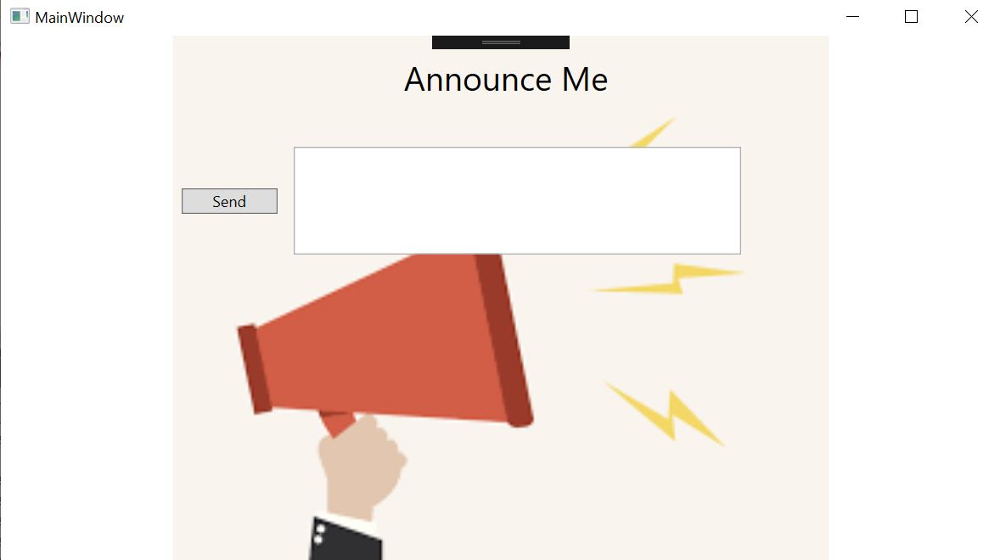
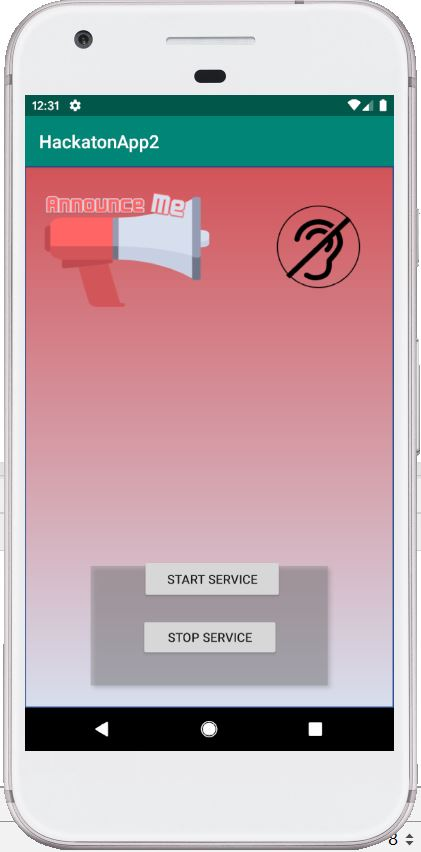

# Hackaton Access
The Hackaton subjet was accessibility - to provide a solution to an existing everyday problem for disabled people.
We addressed the issue that deaf people do not hear the announcing systems in different places such as the train station, airport and more. Our solution for the problen is a system that converts a spoken message from voice to text and displays the message on the mobile application.
The system consists of 3 parts:

## Web program
The web program connect to the system announces and knows when a new message is coming, when there is a new massage the program send to the next part.
the web progeam is at C#.

The program listener to all the massage that come, send to the algorithm in the next section and then show the massage before senging it to all the people that "listener" to the service. 
we can make change in the massage and then click on "Send". 

## Algorithem convert - voice to text
Using a algorithm open source of google to cover from voice to text. 
the algorithm is at python. 

## Android app
Android application that connect to the local service and get the new massage as a "pop up" massage.

